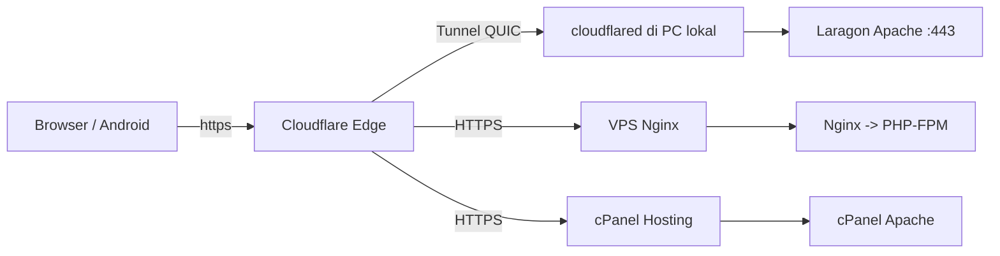

# Panduan Domain & Cloudflare — `https://jagapadi.my.id`

> **Tujuan:** setup lengkap domain `jagapadi.my.id` (apex) + `www.jagapadi.my.id` di Cloudflare agar situs tampil `https://` yang aman, cepat, dan stabil.  
> **Reusabel:** ganti `jagapadi.my.id` → domain Anda sendiri untuk menerapkan di web/proyek lain. Semua langkah berbasis **Cloudflare Free Plan** (tanpa biaya).

> **Referensi terkait:**  
> - Setup Tunnel server lokal (sudah live): [`PANDUAN_HOSTING_SERVER_LOKAL_CLOUDFLARE.md`](PANDUAN_HOSTING_SERVER_LOKAL_CLOUDFLARE.md)  
> - Deploy VPS Nginx : [`DEPLOY.md`](DEPLOY.md) · cPanel : [`PANDUAN_DEPLOYMENT.md`](PANDUAN_DEPLOYMENT.md)  
> - Konfigurasi app : [`.env.example`](../.env.example) · [`config/config.php`](../config/config.php) · [`.htaccess`](../.htaccess)

---

## Daftar Isi

1. [Arsitektur & Pilihan Hosting](#1-arsitektur--pilihan-hosting)
2. [Beli Domain & Siapkan Akun Cloudflare](#2-beli-domain--siapkan-akun-cloudflare)
3. [Tambahkan Site ke Cloudflare & Ganti Nameserver](#3-tambahkan-site-ke-cloudflare--ganti-nameserver)
4. [DNS Records — Template Reusabel](#4-dns-records--template-reusabel)
5. [SSL / TLS — Wajib HTTPS](#5-ssl--tls--wajib-https)
6. [Redirect www, HTTPS & Security Headers](#6-redirect-www-https--security-headers)
7. [Caching, Speed & Firewall](#7-caching-speed--firewall)
8. [Konfigurasi Origin Server (Apache / Nginx / cPanel)](#8-konfigurasi-origin-server-apache--nginx--cpanel)
9. [Konfigurasi Aplikasi JAGAPADI](#9-konfigurasi-aplikasi-jagapadi)
10. [Verifikasi End-to-End](#10-verifikasi-end-to-end)
11. [Template untuk Proyek Lain](#11-template-untuk-proyek-lain)
12. [Troubleshooting](#12-troubleshooting)
13. [Checklist Cetak](#13-checklist-cetak)

---

## 1. Arsitektur & Pilihan Hosting

JAGAPADI saat ini **live** dengan skema **Cloudflare Tunnel** (tanpa IP publik). Untuk proyek lain, pilih salah satu:

| Opsi | Cocok untuk | DNS di Cloudflare | Perlu IP Publik? | Sertifikat Origin |
|---|---|---|---|---|
| **A. Cloudflare Tunnel** *(dipakai `jagapadi.my.id` sekarang)* | PC/Laptop server lokal, Laravel/Laragon, UMKM, behind CGNAT | `CNAME` → `<uuid>.cfargotunnel.com` (Proxy ON) | **Tidak** | Self-signed Laragon cukup (`noTLSVerify: true`) |
| **B. VPS / VM (Nginx + Certbot)** | Ubuntu VPS, Docker, production pemerintah | `A` → IP VPS (Proxy ON) | **Ya** | Let's Encrypt via `certbot --nginx` |
| **C. Shared Hosting cPanel** | Jagoan Hosting, Niagahoster, dll. | `A` → IP hosting atau `CNAME` → target cPanel | Tergantung hosting | **AutoSSL** cPanel |

> Proyek JAGAPADI menjalankan **Opsi A** untuk `jagapadi.my.id` dan **Opsi C** untuk `jagapadi.bpsjember.my.id` (subdomain kantor). Anda bisa kombinasikan.



---

## 2. Beli Domain & Siapkan Akun Cloudflare

### 2.1 Beli domain `jagapadi.my.id`

Contoh aktual JAGAPADI: **DomaiNesia** (provider mana pun bisa — Niagahoster, Rumahweb, Cloudflare Registrar, Namecheap).

1. Cari `jagapadi.my.id` → Checkout (ekstensi `.my.id` butuh KTP/identitas sesuai ketentuan PANDI).
2. Setelah aktif, **jangan** utak-atik nameserver dulu sampai Site ditambahkan di Cloudflare (§3).
3. Catat:
   - Registrar: DomaiNesia
   - Tanggal aktif/expired
   - Akun email pemilik domain

> **Untuk proyek lain:** ganti `jagapadi.my.id` → `namadomainanda.com` / `.id` / `.go.id`. Langkahnya identik.

### 2.2 Buat akun Cloudflare

1. Daftar di https://dash.cloudflare.com → verifikasi email.
2. Siapkan akses **Domain Registrar** (login DomaiNesia) — Anda akan mengganti nameserver di sana.

---

## 3. Tambahkan Site ke Cloudflare & Ganti Nameserver

### Langkah 3.1 — Add Site

1. Cloudflare Dashboard → **Add a Site** → ketik `jagapadi.my.id` → **Add site**.
2. Pilih **Free** → **Continue**.
3. Cloudflare akan **scan DNS existing** (biarkan apa adanya dulu) → **Continue**.

### Langkah 3.2 — Ganti Nameserver di Registrar

Cloudflare menampilkan 2 nameserver khusus untuk domain Anda. **Contoh aktual JAGAPADI:**

```
abby.ns.cloudflare.com
camilo.ns.cloudflare.com
```

> Setiap domain dapat berbeda pasangan nameserver. Selalu pakai yang ditampilkan Cloudflare untuk domain Anda.

Di DomaiNesia:

1. Client Area → My Domains → `jagapadi.my.id` → **Nameservers** → **Use Custom Nameservers**.
2. Tempel kedua nameserver Cloudflare → Save.
3. Tunggu propagasi **5 menit – 24 jam** (umumnya 10–30 menit).

### Langkah 3.3 — Verifikasi

```powershell
# PowerShell / CMD
nslookup -type=NS jagapadi.my.id
# Harus menampilkan abby.ns.cloudflare.com & camilo.ns.cloudflare.com

# Alternatif: cek global propagation
# Buka https://dnschecker.org/#NS/jagapadi.my.id
```

Di Cloudflare: **Overview** → status berubah `Active` (hijau). Jika masih `Pending`, tunggu atau klik **Check nameservers**.

---

## 4. DNS Records — Template Reusabel

Buka **Cloudflare → DNS → Records**. Aturan umum:

- **Proxy status = Proxied (awan oranye ☁️)** = trafik lewat Cloudflare (WAF, cache, SSL edge aktif) → **Direkomendasikan**.
- **DNS only (awan abu ☁️)** = direct ke origin (bypass Cloudflare) → hanya untuk debug.

### 4.1 Skenario A — Cloudflare Tunnel (dipakai `jagapadi.my.id`)

> Tidak perlu `A` record ke IP. Cukup `CNAME` tunnel yang dibuat `cloudflared`.

1. Buat tunnel sekali di server lokal (lihat [`PANDUAN_HOSTING_SERVER_LOKAL_CLOUDFLARE.md`](PANDUAN_HOSTING_SERVER_LOKAL_CLOUDFLARE.md) §3A):

   ```powershell
   & "C:\Program Files (x86)\cloudflared\cloudflared.exe" tunnel create jagapadi-server
   & "C:\Program Files (x86)\cloudflared\cloudflared.exe" tunnel route dns jagapadi-server jagapadi.my.id
   & "C:\Program Files (x86)\cloudflared\cloudflared.exe" tunnel route dns jagapadi-server www.jagapadi.my.id
   ```

2. Cloudflare otomatis membuat:

   | Type | Name | Target | Proxy | TTL |
   |---|---|---|---|---|
   | CNAME | `jagapadi.my.id` | `<uuid>.cfargotunnel.com` | Proxied | Auto |
   | CNAME | `www` | `<uuid>.cfargotunnel.com` | Proxied | Auto |

3. `config.yml` tunnel (aktual, `C:\Users\IPDS\.cloudflared\config.yml`):

   ```yaml
   tunnel: 168ca50f-e89f-4c18-8d70-c5427121dbe6
   credentials-file: C:\Users\IPDS\.cloudflared\168ca50f-e89f-4c18-8d70-c5427121dbe6.json
   ingress:
     - hostname: jagapadi.my.id
       service: https://127.0.0.1:443
       originRequest:
         noTLSVerify: true
         httpHostHeader: jagapadi.my.id
     - hostname: www.jagapadi.my.id
       service: https://127.0.0.1:443
       originRequest:
         noTLSVerify: true
         httpHostHeader: www.jagapadi.my.id
     - service: http_status:404
   ```

> **Untuk proyek lain:** ganti `jagapadi.my.id`/`www.jagapadi.my.id` → `domainanda.com`/`www.domainanda.com` dan `service:` → `http://localhost:80` atau `https://127.0.0.1:443` sesuai origin Anda.

### 4.2 Skenario B — VPS (Nginx)

| Type | Name | Content (IPv4) | Proxy | Keterangan |
|---|---|---|---|---|
| A | `@` (atau `jagapadi.my.id`) | `203.0.113.10` | Proxied | IP VPS |
| A | `www` | `203.0.113.10` | Proxied | Bisa juga `CNAME www → jagapadi.my.id` |
| AAAA | `@` | `2001:db8::1` | Proxied | Opsional IPv6 |

### 4.3 Skenario C — Shared Hosting cPanel

| Type | Name | Content | Proxy | Keterangan |
|---|---|---|---|---|
| A | `@` | IP hosting (lihat cPanel → Server Information) | Proxied **atau** DNS only* | Cek kebijakan hosting |
| CNAME | `www` | `jagapadi.my.id` | Proxied | Alias apex |
| MX, TXT | — | Sesuai email hosting | DNS only | Jangan di-proxy |

> *Beberapa shared hosting **wajib DNS only** untuk AutoSSL validasi awal. Setelah SSL aktif, bisa Proxied kembali. Tes `curl -I https://domain`.

### 4.4 Email (MX) — Jangan sampai salah proxy

Jika email pakai `jagapadi.my.id` (Google Workspace / cPanel Mail):

| Type | Name | Content | Proxy | Priority |
|---|---|---|---|---|
| MX | `@` | `mail.jagapadi.my.id` atau `aspmx.l.google.com` | **DNS only** | 10 |
| TXT | `@` | `v=spf1 include:_spf.google.com ~all` | DNS only | — |
| CNAME | `mail` | `jagapadi.my.id` | DNS only | — |

> **Jangan pernah** set Proxy ON untuk record `MX`/`mail` — email akan gagal.

---

## 5. SSL / TLS — Wajib HTTPS

Buka **Cloudflare → SSL/TLS**.

### 5.1 Mode enkripsi

| Mode | Arti | Kapan dipakai |
|---|---|---|
| **Flexible** | Browser→CF = HTTPS, CF→Origin = HTTP | ❌ Jangan pakai (data origin polos) |
| **Full** | CF→Origin = HTTPS (boleh self-signed) | ✅ Tunnel Laragon self-signed (`noTLSVerify: true`) |
| **Full (Strict)** | CF→Origin = HTTPS valid (CA terpercaya) | ✅ VPS Let's Encrypt / cPanel AutoSSL |
| **Off** | Tanpa HTTPS | ❌ Jangan |

**Rekomendasi JAGAPADI:**

- `jagapadi.my.id` (Tunnel) → **Full** (karena `laragon.crt` self-signed)
- `jagapadi.bpsjember.my.id` (cPanel AutoSSL) → **Full (Strict)**

### 5.2 Edge Certificates

**SSL/TLS → Edge Certificates:**

- [x] **Always Use HTTPS** = ON (HTTP → 301 HTTPS)
- [x] **Automatic HTTPS Rewrites** = ON (fix mixed-content)
- [x] **Opportunistic Encryption** = ON
- [x] **TLS 1.3** = ON
- **Minimum TLS Version** = `1.2` (tinggalkan 1.0/1.1)
- [x] **Universal SSL** = ON (sertifikat `*.jagapadi.my.id` otomatis)

### 5.3 Origin Certificate (opsional tapi bagus untuk VPS)

Untuk VPS tanpa Certbot, bisa pakai **Cloudflare Origin Certificate** (15 tahun):

1. SSL/TLS → Origin Server → Create certificate → Hostnames: `jagapadi.my.id, *.jagapadi.my.id` → Create.
2. Pasang di Nginx:

   ```nginx
   ssl_certificate /etc/ssl/certs/cloudflare-origin.pem;
   ssl_certificate_key /etc/ssl/private/cloudflare-origin.key;
   ```

---

## 6. Redirect www, HTTPS & Security Headers

### 6.1 Redirect `www` → apex (atau sebaliknya) — satu sumber kanonik

JAGAPADI memilih **apex kanonik** (`https://jagapadi.my.id`), `www` redirect 301 ke apex.

**Cloudflare → Rules → Redirect Rules → Create rule:**

```
Rule name: www -> apex
When: (http.host eq "www.jagapadi.my.id")
Then: Dynamic redirect -> 301 -> https://jagapadi.my.id${uri.path}${uri.query}
```

> Untuk proyek lain yang ingin `www` kanonik, balik arahnya.

### 6.2 Force HTTPS (cadangan)

Jika **Always Use HTTPS** belum aktif, buat Redirect Rule:

```
(http.request.scheme eq "http") -> 301 -> https://${http.host}${uri.path}${uri.query}
```

### 6.3 Security Headers di Origin

`.htaccess` JAGAPADI sudah mengirim (lihat [`/.htaccess`](../.htaccess)):

```apache
Header set X-Content-Type-Options "nosniff"
Header set X-Frame-Options "DENY"
Header set Referrer-Policy "strict-origin-when-cross-origin"
Header set Content-Security-Policy "default-src 'self'; script-src 'self' 'unsafe-inline' https://code.jquery.com https://cdn.jsdelivr.net ...; frame-ancestors 'none';"
Header always set Strict-Transport-Security "max-age=31536000; includeSubDomains"
```

> HSTS `preload` hanya aktifkan setelah yakin 100% HTTPS permanen + subdomain semua HTTPS.

**Cloudflare → SSL/TLS → Edge Certificates → HSTS:**

- Aktifkan **HSTS** setelah site stabil 1–2 minggu HTTPS tanpa error:
  - Max Age: `12 months` (31536000)
  - Include subdomains: ON
  - Preload: OFF dulu (ON jika sudah daftar hstspreload.org)

---

## 7. Caching, Speed & Firewall

### 7.1 Caching

**Cloudflare → Caching:**

| Setting | Nilai | Alasan |
|---|---|---|
| Caching Level | Standard | — |
| Browser Cache TTL | 4 hours | Seimbang |
| Development Mode | OFF (ON hanya saat debug) | Bypass cache saat develop |
| Purge Cache | Purge Everything setelah deploy besar | — |

**Cache Rules (baru) — jangan cache halaman dinamis:**

```
Rule: bypass-dynamic
When: (http.request.uri.path contains "/api/" or http.request.uri.path contains "/login" or http.request.uri.path contains "/dashboard")
Then: Bypass cache
```

Assets statis (`/assets/*`, `/css/*`, `/js/*`) biarkan di-cache 7 hari — sudah di-handle Nginx (lihat [`DEPLOY.md`](DEPLOY.md) §6).

### 7.2 Speed → Optimization

- [x] **Auto Minify**: ☑ JavaScript, ☑ CSS, ☑ HTML
- [x] **Brotli** = ON
- [x] **Rocket Loader** = **OFF** (sering pecahkan jQuery/AdminLTE JAGAPADI)
- [x] **Early Hints** = ON

### 7.3 Firewall / WAF

Cloudflare Free sudah aktifkan **Managed WAF** dasar.

**Security → WAF → Custom rules** (contoh untuk semua proyek):

```
Rule: block-sensitive-paths
When: (http.request.uri.path contains ".env" or http.request.uri.path contains ".git" or http.request.uri.path contains ".sql")
Then: Block
```

**Security → Bots → Configure:**

- [x] **Bot Fight Mode** = ON
- **Definitely Automated** → Block

**Security → DDoS:** biarkan default (otomatis).

---

## 8. Konfigurasi Origin Server (Apache / Nginx / cPanel)

### 8.1 Laragon Apache (dipakai `jagapadi.my.id` sekarang)

File: `C:\laragon\etc\apache2\sites-enabled\auto.jagapadi-3509.test.conf` (lihat [`PANDUAN_HOSTING_SERVER_LOKAL_CLOUDFLARE.md`](PANDUAN_HOSTING_SERVER_LOKAL_CLOUDFLARE.md) §3B):

```apache
<VirtualHost *:80>
    DocumentRoot "C:/laragon/www/jagapadi-3509"
    ServerName jagapadi-3509.test
    ServerAlias *.jagapadi-3509.test jagapadi.my.id *.jagapadi.my.id

    Alias /api/v1 "C:/laragon/www/jagapadi-3509/backend/public"
    <Directory "C:/laragon/www/jagapadi-3509/backend/public">
        AllowOverride All
        Require all granted
    </Directory>
    <Directory "C:/laragon/www/jagapadi-3509">
        AllowOverride All
        Require all granted
    </Directory>
</VirtualHost>

<VirtualHost *:443>
    DocumentRoot "C:/laragon/www/jagapadi-3509"
    ServerName jagapadi-3509.test
    ServerAlias *.jagapadi-3509.test jagapadi.my.id *.jagapadi.my.id
    SSLEngine on
    SSLCertificateFile "C:/laragon/etc/ssl/laragon.crt"
    SSLCertificateKeyFile "C:/laragon/etc/ssl/laragon.key"

    Alias /api/v1 "C:/laragon/www/jagapadi-3509/backend/public"
    <Directory "C:/laragon/www/jagapadi-3509/backend/public">
        AllowOverride All
        Require all granted
    </Directory>
</VirtualHost>
```

**`.htaccess` force-HTTPS yang Cloudflare-aware** (lihat [`/.htaccess`](../.htaccess)):

```apache
RewriteCond %{HTTPS} off
RewriteCond %{HTTP:X-Forwarded-Proto} !https [NC]
RewriteCond %{HTTP_HOST} !^localhost$ [NC]
RewriteCond %{HTTP_HOST} !^127\.0\.0\.1$ [NC]
RewriteCond %{HTTP_HOST} !^10\. [NC]
RewriteCond %{HTTP_HOST} !^192\.168\. [NC]
RewriteCond %{HTTP_HOST} !^172\.(1[6-9]|2[0-9]|3[0-1])\. [NC]
RewriteRule ^(.*)$ https://%{HTTP_HOST}%{REQUEST_URI} [L,R=301]
```

> Tanpa baris `X-Forwarded-Proto`, Tunnel akan **redirect loop**.

### 8.2 Nginx (VPS)

Lihat template lengkap di [`DEPLOY.md`](DEPLOY.md) §6. Poin Cloudflare:

```nginx
# Cloudflare → Nginx: jangan lupa trust proxy untuk IP asli
set_real_ip_from 173.245.48.0/20;
set_real_ip_from 103.21.244.0/22;
# ... (daftar IP Cloudflare https://www.cloudflare.com/ips/)
real_ip_header CF-Connecting-IP;

server {
    listen 443 ssl http2;
    server_name jagapadi.my.id www.jagapadi.my.id;
    root /var/www/jagapadi/backend/public;

    ssl_certificate /etc/letsencrypt/live/jagapadi.my.id/fullchain.pem;
    ssl_certificate_key /etc/letsencrypt/live/jagapadi.my.id/privkey.pem;

    add_header X-Frame-Options DENY;
    add_header X-Content-Type-Options nosniff;
    add_header Referrer-Policy strict-origin-when-cross-origin;
    server_tokens off;
    client_max_body_size 12M;

    location ~* /(app|config|database|storage|tests|vendor)/ { deny all; return 404; }
    location ~* \.(env|git|sql|log)$ { deny all; return 404; }
    location ~* /assets/uploads/.*\.php$ { deny all; return 404; }

    location / { try_files $uri $uri/ /index.php?$query_string; }
    location ~ \.php$ {
        include snippets/fastcgi-php.conf;
        fastcgi_pass unix:/var/run/php/php8.2-fpm.sock;
        fastcgi_param SCRIPT_FILENAME $document_root$fastcgi_script_name;
        include fastcgi_params;
    }
}
server {
    listen 80;
    server_name jagapadi.my.id www.jagapadi.my.id;
    return 301 https://$host$request_uri;
}
```

### 8.3 cPanel

- **Domains → Domains** → set Document Root → `backend/public` atau `public_html/jagapadi.my.id` sesuai struktur.
- **SSL/TLS Status → Run AutoSSL** untuk `jagapadi.my.id` + `www.jagapadi.my.id`.
- Pastikan **.htaccess** sama seperti §8.1 (Laravel/CI/PHP native semua bisa pakai pola yang sama).

---

## 9. Konfigurasi Aplikasi JAGAPADI

### 9.1 `.env` (di server, permission 600, jangan commit)

```ini
APP_NAME=JAGAPADI
APP_ENV=production
APP_DEBUG=false
# Kanonik domain aktual — wajib https://
APP_URL=https://jagapadi.my.id
# Untuk Tunnel: tetap https://jagapadi.my.id walau origin http/https lokal
# Untuk VPS: sama

DB_HOST=127.0.0.1
DB_PORT=3306
DB_NAME=jagapadi_prod          # atau bpsjembe_jagapadi_3509 (cPanel)
DB_USER=jagapadi_user
DB_PASS=<password-kuat>
DB_CHARSET=utf8mb4

JWT_SECRET=<64-hex-random>    # php -r "echo bin2hex(random_bytes(32));"
JWT_EXPIRY=3600

# Origin yang boleh akses API/AJAX (pisahkan koma, tanpa spasi berlebih)
CORS_ALLOWED_ORIGINS=https://jagapadi.my.id,https://www.jagapadi.my.id

# Untuk subdomain kantor (opsional)
# CORS_ALLOWED_ORIGINS=https://jagapadi.my.id,https://jagapadi.bpsjember.my.id,https://bpsjember.my.id

ADMIN_EMAIL=admin@jagapadi.my.id
SMTP_FROM=no-reply@jagapadi.my.id
```

> `index.php:113-122` & `backend/public/index.php:105` sudah whitelist `https://jagapadi.bpsjember.my.id` / `https://bpsjember.my.id` untuk kompatibilitas. Untuk `jagapadi.my.id`, **wajib** set `CORS_ALLOWED_ORIGINS` di atas atau request lintas-origin akan ditolak.

### 9.2 Build Android (Flutter)

```bash
# Tunnel live — wajib HTTPS, path /api/v1 (canonical Backend v1)
flutter build apk --release \
  --dart-define=API_BASE_URL=https://jagapadi.my.id/api/v1

# Verifikasi validasi di mobile/lib/core/config.dart:
# - menolak http://, empty, dan path jagapadi-3509 (legacy)
```

Skrip jadi: `mobile/build-apk.ps1 -Target prod` (sudah set `https://jagapadi.my.id/api/v1`).

### 9.3 Checklist `.env` untuk proyek lain

Salin file [`../.env.example`](../.env.example) → `.env` di server, ganti:

| Ganti | Dari | Ke |
|---|---|---|
| `APP_URL` | `https://jagapadi.bpsjember.my.id` | `https://domainanda.com` |
| `DB_NAME/USER/PASS` | `bpsjembe_*` | user/DB hosting Anda |
| `CORS_ALLOWED_ORIGINS` | `https://jagapadi.bpsjember.my.id` | `https://domainanda.com,https://www.domainanda.com` |
| `JWT_SECRET` | placeholder | `php -r "echo bin2hex(random_bytes(32));"` |
| `ADMIN_EMAIL/SMTP_FROM` | `@bpsjember.my.id` | `@domainanda.com` |

---

## 10. Verifikasi End-to-End

Jalankan berurutan setelah setup:

```powershell
# 1. DNS sudah Active?
nslookup -type=NS jagapadi.my.id
# -> abby.ns.cloudflare.com, camilo.ns.cloudflare.com

# 2. DNS record ke Cloudflare?
nslookup jagapadi.my.id
# -> 104.x.x.x / 172.x.x.x (IP Cloudflare, bukan IP origin — benar jika Proxied)

# 3. HTTPS hidup?
curl.exe -I https://jagapadi.my.id
# -> HTTP/2 200, server: cloudflare, cf-ray: ...-SIN, strict-transport-security: ...

curl.exe -I https://www.jagapadi.my.id
# -> HTTP/2 301 -> https://jagapadi.my.id/  (jika redirect www->apex aktif)

# 4. Health API
curl.exe -s https://jagapadi.my.id/api/v1/health
# -> {"success":true,"database":"connected",...}

# 5. Web login & dashboard
# Buka https://jagapadi.my.id/login -> form tampil, login admin OK

# 6. File sensitif harus 403/404
curl.exe -I https://jagapadi.my.id/.env
curl.exe -I https://jagapadi.my.id/.git/config
# -> 403 atau 404 (bukan 200)

# 7. SSL Labs (skor A/A+ diharapkan)
# Buka https://www.ssllabs.com/ssltest/analyze.html?d=jagapadi.my.id

# 8. Tunnel sehat? (khusus Opsi A)
& "C:\Program Files (x86)\cloudflared\cloudflared.exe" tunnel info jagapadi-server
# -> 4 connections, SIN, Healthy
Get-ScheduledTask -TaskName "Cloudflared-Jagapadi"
Get-Process cloudflared
```

Jika salah satu gagal, lihat §12.

---

## 11. Template untuk Proyek Lain

### 11.1 Salin-tempel untuk domain baru

Ganti `jagapadi.my.id` → `tokosaya.com` di semua tempat:

**Cloudflare DNS:**

| Type | Name | Target | Proxy |
|---|---|---|---|
| CNAME | `@` | `<tunnel-uuid>.cfargotunnel.com` | Proxied | ← jika Tunnel
| CNAME | `www` | `<tunnel-uuid>.cfargotunnel.com` | Proxied |
| *atau* | | | |
| A | `@` | `203.0.113.10` | Proxied | ← jika VPS

**`config.yml` tunnel:**

```yaml
tunnel: <uuid-baru>
credentials-file: C:\Users\Anda\.cloudflared\<uuid>.json
ingress:
  - hostname: tokosaya.com
    service: https://127.0.0.1:443
    originRequest: { noTLSVerify: true, httpHostHeader: tokosaya.com }
  - hostname: www.tokosaya.com
    service: https://127.0.0.1:443
    originRequest: { noTLSVerify: true, httpHostHeader: www.tokosaya.com }
  - service: http_status:404
```

**`.env`:**

```ini
APP_URL=https://tokosaya.com
CORS_ALLOWED_ORIGINS=https://tokosaya.com,https://www.tokosaya.com
```

**`.htaccess` & VirtualHost:** ganti `ServerAlias tokosaya.com *.tokosaya.com` (sisanya identik).

**Redirect Rule Cloudflare:** `www.tokosaya.com` → `https://tokosaya.com${uri.path}${uri.query}`.

### 11.2 Daftar periksa domain baru (5 menit)

```
[ ] Beli domain → Add Site Cloudflare (Free) → ganti nameserver → tunggu Active
[ ] DNS: CNAME tunnel atau A ke IP (Proxied ON)
[ ] SSL/TLS: Full atau Full Strict, Always Use HTTPS ON, Min TLS 1.2
[ ] Redirect Rule: www -> apex (301)
[ ] Origin: .htaccess X-Forwarded-Proto + VirtualHost/Alias benar
[ ] .env: APP_URL=https, CORS_ALLOWED_ORIGINS=https://domain (+ www)
[ ] Verifikasi: curl -I, /api/health, /.env 403, SSL Labs A
```

---

## 12. Troubleshooting

| Gejala | Penyebab | Solusi |
|---|---|---|
| `Pending Nameserver Update` berhari-hari | Nameserver salah/typo di registrar | Samakan persis 2 nameserver Cloudflare, cek `whois jagapadi.my.id` |
| `Error 1033` / `404` Cloudflare | Ingress `hostname` tidak cocok DNS | `config.yml` hostname harus `jagapadi.my.id` & `www.jagapadi.my.id` persis |
| `Error 526` Invalid SSL cert | Origin 443 mati / cert berubah | `curl.exe -k -I https://127.0.0.1/` harus 200; restart Laragon Apache |
| Redirect loop `ERR_TOO_MANY_REDIRECTS` | `.htaccess` tidak cek `X-Forwarded-Proto` | Pakai blok §8.1 yang ada `RewriteCond %{HTTP:X-Forwarded-Proto} !https` |
| `www` tidak redirect | Redirect Rule belum dibuat / urutan salah | Buat Redirect Rule §6.1, posisikan di atas |
| `/api/v1/health` 404 tapi `/` hidup | `Alias /api/v1` hilang di vhost `:443` | Tambah `Alias` di **kedua** VirtualHost `:80` dan `:443` |
| `CORS error` di browser | Origin tidak di allowlist | Set `CORS_ALLOWED_ORIGINS=https://jagapadi.my.id,https://www.jagapadi.my.id` + restart |
| Email tidak masuk | MX di-proxy (oranye) | MX/TXT/`mail` harus **DNS only** (abu) |
| Tunnel `0 connections` | `cloudflared` tidak jalan | `Get-Process cloudflared` kosong → jalankan manual §4.1 atau cek Scheduled Task |
| `Rocket Loader` pecahkan JS | Optimasi agresif | **OFF-kan Rocket Loader** (Speed → Optimization) |

**Perintah diagnosis cepat:**

```powershell
# Windows
Get-Process cloudflared; Get-ScheduledTask -TaskName "Cloudflared-Jagapadi"
& "C:\Program Files (x86)\cloudflared\cloudflared.exe" tunnel list
& "C:\Program Files (x86)\cloudflared\cloudflared.exe" tunnel info jagapadi-server
curl.exe -I https://jagapadi.my.id; curl.exe -s https://jagapadi.my.id/api/v1/health
curl.exe -k -I https://127.0.0.1/
nslookup jagapadi.my.id; nslookup -type=NS jagapadi.my.id
```

```bash
# Linux/VPS
sudo systemctl status cloudflared  # jika service
dig jagapadi.my.id +short
curl -I https://jagapadi.my.id
sudo nginx -t && sudo systemctl reload nginx
```

---

## 13. Checklist Cetak

```
DOMAIN & CLOUDFLARE — https://jagapadi.my.id
[ ] Nameserver: abby.ns.cloudflare.com, camilo.ns.cloudflare.com → Active
[ ] DNS: CNAME jagapadi.my.id & www → <uuid>.cfargotunnel.com (Proxied)
[ ] DNS: MX/TXT mail = DNS only
[ ] SSL/TLS: Full, Always Use HTTPS ON, Auto HTTPS Rewrites ON, Min TLS 1.2, TLS 1.3 ON
[ ] Rules: Redirect www.jagapadi.my.id -> https://jagapadi.my.id (301)
[ ] Rules: Cache bypass untuk /api/*, /login, /dashboard
[ ] Speed: Brotli ON, Rocket Loader OFF
[ ] Firewall: WAF block .env/.git/.sql, Bot Fight Mode ON
[ ] Origin: Apache vhost :80 + :443 dengan ServerAlias jagapadi.my.id, Alias /api/v1
[ ] Origin: .htaccess X-Forwarded-Proto (anti loop)
[ ] App: APP_URL=https://jagapadi.my.id, CORS_ALLOWED_ORIGINS=https://jagapadi.my.id,https://www.jagapadi.my.id
[ ] Verifikasi: curl -I 200, /health connected, /.env 403, SSL Labs A
[ ] Operasional: Scheduled Task + VBS startup aktif, UPS + BIOS AC Back ON
```

---

*Dokumen ini melengkapi [`PANDUAN_HOSTING_SERVER_LOKAL_CLOUDFLARE.md`](PANDUAN_HOSTING_SERVER_LOKAL_CLOUDFLARE.md) (detail Tunnel & SOP harian). Untuk VPS/cPanel, ikuti [`DEPLOY.md`](DEPLOY.md) / [`PANDUAN_DEPLOYMENT.md`](PANDUAN_DEPLOYMENT.md) dengan mengganti domain ke `jagapadi.my.id` sesuai §11.*

**Kontak operasional:** https://jagapadi.my.id · https://www.jagapadi.my.id · API `https://jagapadi.my.id/api/v1` · Cloudflare https://dash.cloudflare.com · Registrar https://client.domainesia.com

*Jangan pernah menempel isi `.env`, `*.json` kredensial tunnel, `cert.pem`, atau password DB ke dokumen ini.*

